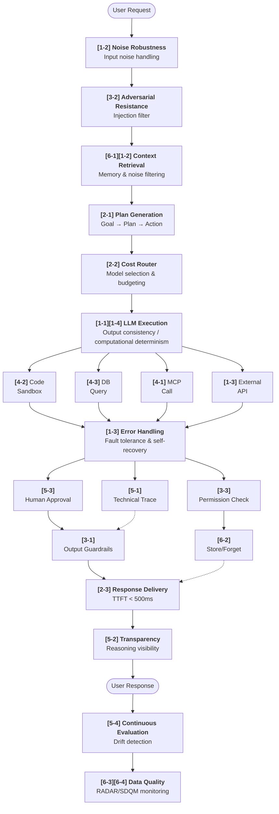

# AI Agent Production Architecture & Readiness Criteria Map

This document provides a comprehensive view of where each evaluation criterion from the AI Agent Production Readiness Check applies within a real-world production architecture.

**Evaluation Structure:** 6 Rubrics / 21 Check Items / Max 105 Points

---

## System Architecture Overview

```mermaid
flowchart TB
    subgraph UI ["🖥️ User Interface Layer"]
        UI1["Web App"]
        UI2["Mobile App"]
        UI3["CLI/API"]
        UI4["Slack/Teams Bot"]
        UI_C["[2-3] Response Latency<br/>[5-2] User-Facing Transparency"]
    end

    subgraph Gateway ["🚪 API Gateway"]
        GW1["Rate Limiting"]
        GW2["Auth OAuth/JWT"]
        GW3["Input Sanitization"]
        GW_C["[1-2] Noise Robustness<br/>[3-2] Adversarial Resistance"]
    end

    subgraph Guardrails ["🛡️ Guardrail Layer"]
        GR_IN["Input Guardrails<br/>• Jailbreak Detection<br/>• PII Detection<br/>• Injection Filter"]
        GR_OUT["Output Guardrails<br/>• PII Filter/Mask<br/>• Toxicity Filter<br/>• Fact Checker"]
        GR_C["[3-1] Risk Boundary Check<br/>[3-2] Adversarial Resistance"]
    end

    subgraph Orchestrator ["🎯 Agent Orchestrator"]
        subgraph Planning ["Planning & Reasoning Module"]
            P1["Goal Decomposer"] --> P2["Plan Generator"] --> P3["Action Selector"] --> P4["Self-Reflection"]
            P_C["[2-1] Goal-Plan-Action Alignment<br/>[1-3] Fault Tolerance & Self-Recovery"]
        end
        subgraph Execution ["Execution Engine"]
            E1["ReAct/Reflexion"]
            E2["Parallel Execution"]
            E3["Error Handler"]
            E4["Timeout Manager"]
            E_C["[1-1] Output Consistency<br/>[1-4] Computational Determinism"]
        end
        subgraph CostOpt ["Model Router & Cost Optimization"]
            C1["Complexity Estimator"] --> C2["Model Selector"] --> C3["Token Budget"] --> C4["Response Cache"]
            C_C["[2-2] Cost Efficiency<br/>[2-3] Response Latency"]
        end
    end

    subgraph Subsystems ["📦 Core Subsystems"]
        subgraph LLM ["LLM Providers"]
            L1["Claude/GPT/Gemini"]
            L2["Embedding Models"]
            L3["Distilled/Cache Models"]
            L_C["[1-1] Output Consistency<br/>[1-4] Computational Determinism"]
        end
        subgraph Memory ["Memory System"]
            M1["Short-Term Memory"]
            M2["Long-Term Memory (Vector DB)"]
            M3["Episodic Memory"]
            M_C["[6-1] Memory Quality<br/>[6-2] Selective Forgetting<br/>[1-2] Noise Robustness"]
        end
        subgraph Tools ["Tool Execution"]
            T1["Tool Router"]
            T2["Tool Registry"]
            T_C["[3-3] Permission Scoping"]
        end
        subgraph HITL ["Human-in-the-Loop"]
            H1["Approval Queue"]
            H2["Interrupt/Override"]
            H3["Escalation Engine"]
            H_C["[5-3] Human Controllability"]
        end
    end

    subgraph External ["🌐 External Integrations"]
        EX1["MCP Servers<br/>[4-1] MCP Security<br/>OAuth 2.1 + PKCE"]
        EX2["Code Sandbox<br/>[4-2] Secure Sandbox<br/>Firecracker/gVisor"]
        EX3["Database<br/>[4-3] Database Guardrails<br/>Read-Only + RLS"]
        EX4["External APIs<br/>[1-3] Fault Tolerance<br/>Retry/Backoff"]
    end

    subgraph Observability ["📊 Observability Stack"]
        subgraph MELT ["MELT"]
            O1["Metrics<br/>p50/p95/p99"]
            O2["Events<br/>Tool Calls"]
            O3["Logs<br/>Structured JSON"]
            O4["Traces<br/>Distributed Tracing"]
        end
        O_C["[5-1] Technical Traceability"]
        subgraph Pipeline ["Continuous Evaluation Pipeline"]
            PP1["CI/CD Regression Tests"] --> PP2["Golden Dataset"] --> PP3["Drift Detection"] --> PP4["Alert Dashboard"]
            PP_C["[5-4] Continuous Evaluation<br/>[6-3] Data Contamination Check<br/>[6-4] Synthetic Data Quality"]
        end
    end

    UI --> Gateway
    Gateway --> Guardrails
    Guardrails --> Orchestrator
    Orchestrator --> LLM
    Orchestrator --> Memory
    Orchestrator --> Tools
    Orchestrator --> HITL
    Tools --> External
    Observability -.-> UI
    Observability -.-> Gateway
    Observability -.-> Guardrails
    Observability -.-> Orchestrator
    Observability -.-> External
```

### Mapping Between Architecture Layers and Check Items

| Layer | Primary Check Items | Notes |
|:---|:----------------|:-----|
| **User Interface** | [2-3] [5-2] | Latency, transparency |
| **API Gateway** | [1-2] [3-2] | Noise robustness, adversarial resistance |
| **Guardrails** | [3-1] [3-2] | Risk boundaries, adversarial resistance |
| **Orchestrator** | [2-1] [1-1] [1-3] [1-4] [2-2] [2-3] | Planning, consistency, recovery, cost |
| **LLM Providers** | [1-1] [1-4] | Output consistency, computational determinism |
| **Memory System** | [6-1] [6-2] [1-2] | Memory quality, forgetting, noise |
| **Tool Execution** | [3-3] | Permission scoping |
| **HITL** | [5-3] | Human intervention |
| **External Integrations** | [4-1] [4-2] [4-3] [1-3] | MCP, sandbox, DB, fault tolerance |
| **Observability** | [5-1] [5-4] [6-3] [6-4] | Traceability, continuous eval, data quality |

---

## Criteria Placement Summary

### Rubric 1: Reliability & Robustness

| Criterion | Location in Architecture | Key Components |
|------|----------------------|------------------|
| **1-1. Output Consistency** | Agent Orchestrator → Execution Engine | ReAct/Reflexion, deterministic settings, temperature=0 |
| **1-2. Noise Robustness** | API Gateway + Memory System | Input noise handling, context noise filtering, HaystackCraft |
| **1-3. Fault Tolerance & Self-Recovery** | External APIs + Planning Module | Retry, backoff, re-planning, strategy switching, state recovery |
| **1-4. Computational Determinism** | Execution Engine + Tool Execution | CodeMem separation, Python sandbox, idempotent tool calls |

### Rubric 2: Efficacy & Performance

| Criterion | Location in Architecture | Key Components |
|------|----------------------|------------------|
| **2-1. Goal-Plan-Action Alignment** | Agent Orchestrator → Planning Module | Goal decomposer, plan generator, self-reflection |
| **2-2. Cost Efficiency** | Model Router & Cost Optimization | Complexity estimator, model selector, token budget, cache |
| **2-3. Response Latency** | All layers (especially UI) | TTFT optimization, streaming, semantic caching, speculative execution |

### Rubric 3: Safety & Governance

| Criterion | Location in Architecture | Key Components |
|------|----------------------|------------------|
| **3-1. Risk Boundary Check** | Guardrail Layer | Input/output guardrails, PII filter, toxicity filter (policy-level) |
| **3-2. Adversarial Resistance** | API Gateway + Guardrail Layer | Jailbreak detection, injection filters, dual guardrail AI |
| **3-3. Permission Scoping** | Tool Execution → Tool Registry | Scoped APIs, least privilege, RBAC, token-level access |

### Rubric 4: Security Architecture

| Criterion | Location in Architecture | Key Components |
|------|----------------------|------------------|
| **4-1. MCP Protocol Security** | External Integrations → MCP Servers | OAuth 2.1, PKCE, resource indicators, heartbeat |
| **4-2. Secure Sandbox** | External Integrations → Code Sandbox | Firecracker MicroVM, gVisor, network isolation (implementation-level) |
| **4-3. Database Guardrails** | External Integrations → Database | Read-only user, query cost estimator, schema whitelist |

### Rubric 5: Observability & Operations

| Criterion | Location in Architecture | Key Components |
|------|----------------------|------------------|
| **5-1. Technical Traceability** | Observability Stack | Metrics, events, logs, traces, eBPF monitoring (developer-facing) |
| **5-2. User-Facing Transparency** | User Interface Layer | Reasoning visualization, progress display, CoT display (end-user) |
| **5-3. Human Controllability** | Human-in-the-Loop Module | Approval queue, interrupt control, escalation engine |
| **5-4. Continuous Evaluation** | Observability → CI/CD Pipeline | Regression tests, golden dataset, drift detection |

### Rubric 6: Memory & Knowledge

| Criterion | Location in Architecture | Key Components |
|------|----------------------|------------------|
| **6-1. Memory Quality & Factuality** | Memory System → Long-Term Memory | Vector DB, episodic memory, J score validation, MemoryOS |
| **6-2. Selective Forgetting & Privacy** | Memory System | Physical deletion, unlearning, S-EL compliance, GDPR |
| **6-3. Data Contamination Check** | Evaluation Pipeline | RADAR analysis, RDS score, n-gram checks |
| **6-4. Synthetic Data Quality** | Evaluation Pipeline | SDQM scoring, distribution comparisons, alpha-Precision/beta-Recall |

---

## Data Flow with Criteria Checkpoints

### Flow Description

| Phase | Check Items | Notes |
|:--------|:------------|:-----|
| **Input Processing** | [1-2] Noise Robustness, [3-2] Adversarial Resistance | Remove input noise and detect attacks |
| **Context Building** | [6-1] Memory Quality, [1-2] Noise Robustness | Retrieve relevant memory and filter context noise |
| **Planning & Optimization** | [2-1] Plan Alignment, [2-2] Cost Efficiency | Goal decomposition, plan generation, model selection |
| **Execution** | [1-1] Output Consistency, [1-4] Computational Determinism | LLM execution and separation of computation |
| **Tool Execution** | [4-1] MCP, [4-2] Sandbox, [4-3] DB Guardrails, [1-3] Fault Tolerance | Parallel tool calls |
| **Error Handling** | [1-3] Fault Tolerance & Self-Recovery | Re-planning and strategy switching on failure |
| **Checks** | [5-3] Human Controllability, [3-3] Permission Scoping, [5-1] Traceability | Approval, permissions, audit |
| **Post-Processing** | [3-1] Risk Boundary Check, [6-2] Selective Forgetting | Output filtering and memory management |
| **Response** | [2-3] Latency, [5-2] User Transparency | Fast delivery and reasoning visibility |
| **Continuous Monitoring** | [5-4] Continuous Evaluation, [6-3] Contamination, [6-4] Synthetic Data Quality | Drift detection and data quality monitoring |

---

## Critical Integration Points

### High-Risk Areas (Score 1-2 is dangerous)

```mermaid
flowchart TB
    Title[/"**Critical Checkpoints**"/]

    subgraph Security ["🔴 Security Boundary (Rubric 3 + 4)"]
        direction TB
        S0[/"**If ≤2: Deployment Prohibited**"/]
        S1["[3-1] Risk Boundary Check<br/>→ Uncontrolled code/file execution"]
        S2["[3-2] Adversarial Resistance<br/>→ Vulnerable to jailbreaks"]
        S3["[3-3] Permission Scoping<br/>→ Excessive privileged access"]
        S4["[4-1] MCP Security<br/>→ Impersonation risk"]
        S5["[4-2] Secure Sandbox<br/>→ Container escape risk"]
        S6["[4-3] DB Guardrails<br/>→ Data destruction risk"]
    end

    subgraph Reliability ["🟠 Reliability Core (Rubric 1 + 6)"]
        direction TB
        R0[/"**If ≤2: Pilot Only**"/]
        R1["[1-1] Output Consistency<br/>→ Unpredictable output"]
        R2["[1-3] Fault Tolerance/Self-Recovery<br/>→ Crash or loops on API failures"]
        R3["[1-4] Computational Determinism<br/>→ Calculation errors, no reproducibility"]
        R4["[6-1] Memory Quality & Factuality<br/>→ Forgetting/hallucinating facts"]
    end

    subgraph Operations ["🟡 Operational Readiness (Rubric 5)"]
        direction TB
        O0[/"**Required for production (≥3)**"/]
        O1["[5-1] Technical Traceability<br/>→ Can answer: why did it fail?"]
        O2["[5-2] User-Facing Transparency<br/>→ Users can see progress"]
        O3["[5-3] Human Controllability<br/>→ Emergency stop is possible"]
        O4["[5-4] Continuous Evaluation<br/>→ Drift detection is active"]
    end

    Title --> Security
    Title --> Reliability
    Title --> Operations
```

| Category | Condition | Outcome |
|:--------|:----|:-----|
| **🔴 Security Boundary** | Any ≤2 | **Deployment Prohibited** |
| **🟠 Reliability Core** | Any ≤2 | **Pilot Only** |
| **🟡 Operational Readiness** | Any <3 | **Not Production Ready** |

---

## Deployment Readiness Matrix

| Rubric | Experimental (0-45) | Beta/Pilot (46-70) | Production (71-90) | Autonomous (91-105) |
|:-------|:-------------:|:-------------------------:|:----------------:|:-----------------:|
| **R1: Reliability** (4 items/20 pts) | ≤8 pts | 9-13 pts | 14-17 pts | 18-20 pts |
| **R2: Efficacy** (3 items/15 pts) | ≤6 pts | 7-10 pts | 11-13 pts | 14-15 pts |
| **R3: Safety** (3 items/15 pts) | ≤6 pts | 7-10 pts | 11-13 pts | 14-15 pts |
| **R4: Security** (3 items/15 pts) | ≤6 pts | 7-10 pts | 11-13 pts | 14-15 pts |
| **R5: Observability** (4 items/20 pts) | ≤8 pts | 9-13 pts | 14-17 pts | 18-20 pts |
| **R6: Memory/Knowledge** (4 items/20 pts) | ≤8 pts | 9-13 pts | 14-17 pts | 18-20 pts |
| **Deployment** | Not allowed | Limited + HITL | Allowed | Allowed + Autonomous |

**Total: 21 items / 105 points**

---

## Quick Reference: Where to Improve

| If low score... | Focus on these components |
|------------------|---------------------------|
| **Rubric 1 (Reliability)** | Execution engine, external API clients, error handler, CodeMem separation |
| **Rubric 2 (Efficacy)** | Planning module, model router, response streaming, semantic cache |
| **Rubric 3 (Safety)** | Guardrail layer, tool registry permissions, API key scopes |
| **Rubric 4 (Security)** | MCP auth settings, sandbox infrastructure, DB user permissions |
| **Rubric 5 (Observability)** | Observability stack, reasoning visualization UI, HITL module, CI/CD pipeline |
| **Rubric 6 (Memory/Knowledge)** | Memory system, vector DB, RADAR evaluation, SDQM evaluation |

---

## Guide for Distinguishing Similar Criteria

These items are similar but differ in evaluation focus:

| Pair | Key Difference |
|---------|--------------|
| **1-1 (Output Consistency)** vs **1-4 (Computational Determinism)** | 1-1 evaluates overall output consistency; 1-4 evaluates LLM vs code separation of computation |
| **3-1 (Risk Boundary Check)** vs **4-2 (Secure Sandbox)** | 3-1 is policy-level (what is allowed); 4-2 is implementation-level (how isolation is enforced) |
| **5-1 (Technical Traceability)** vs **5-2 (User-Facing Transparency)** | 5-1 is developer-facing (debugging); 5-2 is end-user-facing (trust building) |
| **1-2 (Noise Robustness)** two aspects | Input noise (user ambiguity) and context noise (RAG distractors) |
| **1-3 (Fault Tolerance)** two aspects | Infrastructure failures (API errors) and cognitive errors (recovery from reasoning mistakes) |
